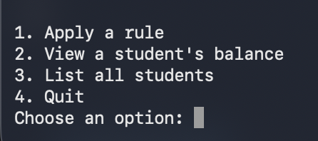

# Student Token Bank
A command-line token tracker for music students, which was built while learning Python 

I built this piece to act as a real rewards system for my private students. The studio I worked at already used a token system, but I wanted to create a digital format to create a more efficient workflow. I was independently learning Python and saw this as a strong use case. 

## Features:
- Creates and maintains list of students.
- Associates a token balance for each student.
- Enables edits to token balance through various token options (homework_completion, extraordinary_performance, reward_redemption, no_practice). 
- Identification of an individual student's token balance.
- Saves and loads between sessions. 

## How to Run:
```
git clone https://github.com/JamesDHoldaway/StudentTokenBank.git
cd StudentTokenBank
python3 -m venv venv
source venv/bin/activate
python3 main.py
```
No external dependencies required, all in base Python. 

## Menu visual:


## What is built so far:
- CLI
- Persistence 
- Menu

## What is planned to be built:
- web version

## Note:
- students.json is not included in the repo because it holds real students names. So a cloned repo will start with an empty roster. 


James Holdaway (https://github.com/JamesDHoldaway)